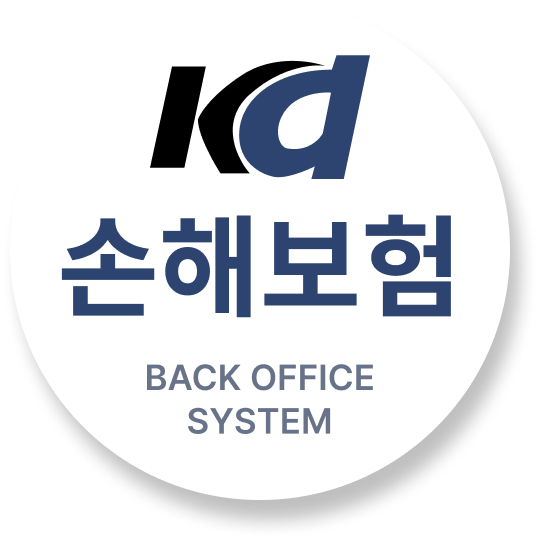
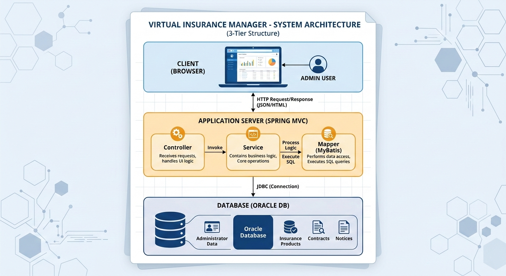
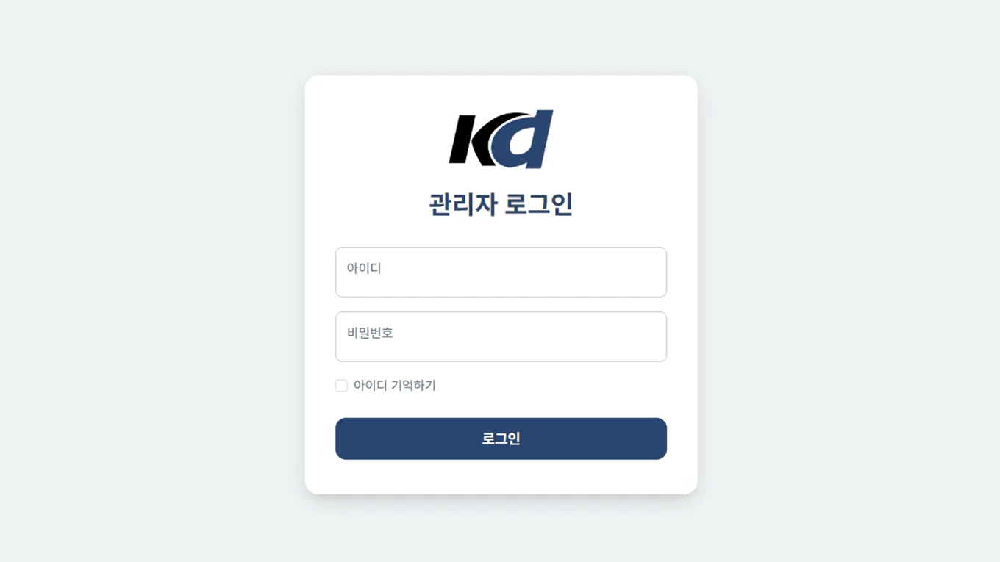
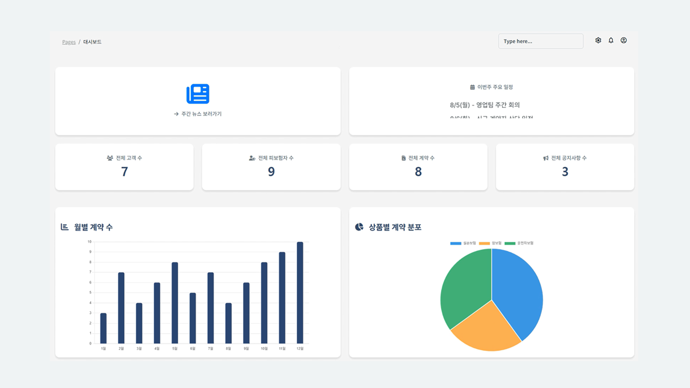
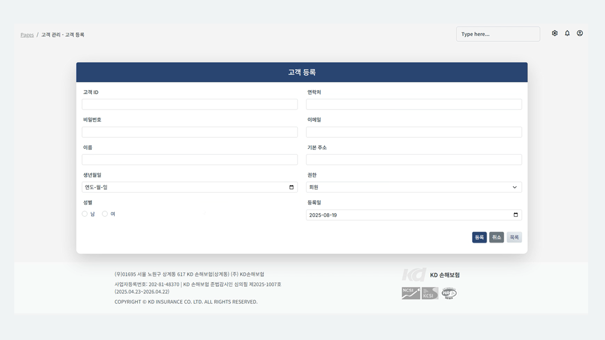
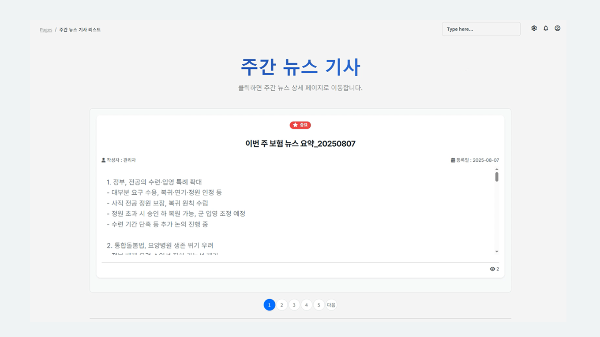

<!-- 로고 이미지 -->

  

<!-- 링크 버튼 -->

  
  
  

<!-- 프로젝트 기본 정보 -->
<h3 align="center">
  Spring MVC와 MyBatis 기반으로 구현한 가상 보험사 관리자 백오피스 시스템입니다.  
  고객, 피보험자, 계약, 공지사항 등 보험사 관리자 업무 데이터를 관리할 수 있도록 구현했으며,  
  UiPath RPA와 ChatGPT API를 연동해 외부 뉴스 수집부터 주간 뉴스 등록까지 자동화했습니다.
</h3>

<h4 align="center">
  [ Back-end Team Project | 6 Members | Jul 8 – Aug 8, 2025 ]
</h4>
 

<!-- 내용 -->
## 🛠 Tech Stack

  
  
  
  
  

  
  
  
  
  
  

  
  
  

  
  
  

  
  

## 🏗️ System Architecture

본 프로젝트는 **Spring MVC 기반의 3-Tier Architecture**로 설계되었습니다. 

- **Client (Browser)**  
  관리자 사용자가 웹 브라우저를 통해 시스템에 접속하며, JSP 기반의 관리자 UI가 렌더링됩니다.

- **Application Server (Spring MVC)**  
  Controller → Service → Mapper(MyBatis) 계층 구조로 구성되어  
  요청 처리, 비즈니스 로직 수행, 데이터 접근을 담당합니다.

- **Database (Oracle DB)**  
  관리자, 고객, 피보험자, 계약, 공지사항 등의 데이터를 저장하고 관리합니다.
  

## ✨ Key Features

### 🔐 인증 및 보안 
* **Spring Security 기반 보안**: 지정된 관리자 계정 외 접근 차단 및 세션 관리
* **로그인 예외 처리**: 
  * 아이디/비밀번호 미입력 시 유효성 검사 및 실패 알림
  * 정보 불일치 시 실시간 피드백 제공

### 📊 대시보드 
* **실시간 데이터 집계**: 전체 고객·피보험자·계약·공지사항 현황 자동 업데이트
* **통계 시각화**: 월별 계약 추이 및 상품별 분포도 차트 구현
* **동적 UI**: 
  * 이번 주 주요일정 롤링(Rolling) 애니메이션 적용
  * 최근 등록된 계약 및 공지사항 퀵 리스트 제공

### 👥 고객 및 계약 관리 
* **고객 및 피보험자**:
  * 고객 정보 CRUD 및 기존 고객 기반 피보험자 다중 매칭/등록
  * **Data Integrity**: 삭제 시 오작동 방지를 위한 컨펌(Confirm) 경고창 단계 적용
* **계약 관리**:
  * 고객별 피보험자 선택 기반의 정밀한 계약 등록 프로세스
  * 상세 내역 조회, 수정 및 계약 해지(삭제) 관리

### 🤖 주간 뉴스 자동화 
* **RPA 연동**: **UI Path**를 활용한 외부 뉴스 사이트 데이터 수집 자동화
* **AI 요약**: 수집된 뉴스를 **ChatGPT API**를 통해 분석 및 핵심 내용 자동 요약
* **자동 포스팅**: 분석된 결과가 관리자 시스템 주간 뉴스 메뉴에 자동으로 등록되는 워크플로우 구축

### 📢 운영 및 시스템 설정 
* **공지사항**: 중요 공지 설정, 본문 관리 및 댓글(Reply) 기능(수정/삭제 포함)
* **백오피스 전용 메뉴 (정적 페이지)**:
  * **보상 관리**: 보상청구 프로세스 관리
  * **시스템 설정**: 관리자 권한 부여, 약관 관리, 시스템 로그 확인
  * **교육 관리**: 관리자용 매뉴얼 및 교육 자료실 운영

### 🛠 관리자 메뉴 구성 (Sitemap)

| 대분류 | 소분류 메뉴 |
| :--- | :--- |
| **영업 관리** | 대시보드, 고객 관리, 피보험자 관리, 계약 관리 |
| **콘텐츠 관리** | 공지사항(댓글), 주간 뉴스(RPA & AI) |
| **시스템 관리** | 보상청구, 시스템 설정, 권한 관리, 약관 관리, 교육 자료, 시스템 로그 |

## 🤖 Automation Feature: Weekly News RPA

본 프로젝트의 핵심 차별점은 **UiPath RPA**와 **OpenAI API**를 결합하여  
외부 뉴스 데이터를 수집하고 ChatGPT를 통해 요약 및 정리한 후  
관리자 페이지의 **주간 뉴스 게시판에 자동 등록하는 업무 자동화 기능**을 구현한 것입니다.

### 🔄 Automation Workflow
RPA는 다음과 같은 순서로 주간 뉴스 업데이트를 수행합니다.

| 단계 | 프로세스 | 주요 작업 내용 |
| :--- | :--- | :--- |
| **01** | **Init** | 환경 변수 및 브라우저 초기 설정, 작업에 필요한 변수 초기화 |
| **02** | **News Extract** | 특정 뉴스 사이트 접속 후 최신 기사 제목 및 본문 텍스트 추출 |
| **03** | **GPT Summary** | **ChatGPT API** 호출을 통해 수집된 기사 원문을 핵심 요약본으로 변환 |
| **04** | **Data Refine** | 요약된 텍스트를 DB 및 웹 등록 규격에 맞게 정제 후 임시 파일(`.txt`) 저장 |
| **05** | **Auto Login** | 관리자 페이지 접속 후 RPA 클릭 이벤트를 통한 자동 인증 수행 |
| **06** | **Upload News** | 정제된 데이터를 주간 뉴스 게시판에 자동 입력 후 최종 등록 |

## 🎥 Feature Demo
> 보험사 관리자 백오피스의 주요 기능을 영상으로 확인할 수 있습니다.

| 🔐 Admin Login | 📊 Admin Dashboard |
| :---: | :---: |
|  |  |
| Spring Security 기반 관리자 로그인 | 실시간 데이터 통계 및 분석 대시보드 |

| 👥 Customer Management | 📰 Weekly News Automation |
| :---: | :---: |
|  |  |
| 고객 정보 CRUD 관리 모듈 | UiPath + ChatGPT API 기반 뉴스 자동화 |
 

## 👤 My Role & Contributions

본 프로젝트에서 프로젝트 기획 및 주요 기능 개발을 담당하고  
팀원들이 참고할 수 있도록 개발 흐름과 작업 순서를 정리하며 협업 환경을 관리했습니다.

### 🏗️ Project Planning & Collaboration
* **프로젝트 기획 및 발표**: 서비스 컨셉 설정, 기획서 작성 및 최종 프로젝트 발표 진행
* **협업 환경 관리**: Notion을 활용하여 개발 문서와 작업 순서를 정리하고 팀원들과 공유
* **개발 흐름 정리**: 프로젝트 진행 과정에서 필요한 작업 가이드를 작성하여 협업 효율 향상

### 💻 Key Implementations
* **Brand Identity**: 프로젝트 컨셉에 맞춘 'KD 손해보험' 로고 디자인 및 로그인 페이지 UI 구현
* **Security**: Spring Security를 활용한 관리자 로그인 인증 및 유효성 검증 로직 구현
* **Admin Dashboard**: 고객 수, 계약 수 등 주요 데이터를 확인할 수 있는 관리자 대시보드 UI 구현
* **Notice Board**: 공지사항 게시판의 댓글(Reply) 등록 기능 및 CRUD 로직 구현

## 💡 Problem Solving

### 1️⃣ Spring Security 권한 기반 로그인 리다이렉트 구현

* **Problem**  
  기본 Spring Security 로그인 설정만으로는 사용자 권한(ROLE_ADMIN 등)에 따라  
  다른 페이지로 이동시키는 기능을 구현하기 어려웠습니다.  
  특히 관리자가 로그인 후 바로 **관리자 대시보드로 이동해야 하는 요구사항**이 있었습니다.

* **Solution**  
  `AuthenticationSuccessHandler`를 구현한 `CustomLoginSuccessHandler`를 작성하여  
  로그인 성공 시 `Authentication` 객체에서 사용자 권한을 확인하고 권한에 따라 이동할 페이지를 분기 처리했습니다.  
  또한 `security-context.xml`에 핸들러를 등록하여 로그인 성공 시 해당 로직이 자동으로 실행되도록 설정했습니다.

* **Result**  
  관리자 계정 로그인 시 관리자 대시보드로 자동 이동  
  사용자 권한 기반 로그인 흐름 구현  
  Spring Security 인증 객체를 활용한 권한 제어 경험 확보

### 2️⃣ 고객 - 피보험자 - 계약 데이터 연결 구조 개선

* **Problem**  
  보험 계약 등록 시 **고객(Customer) - 피보험자(InsuredPerson) - 계약(Contract)** 데이터가  
  서로 연결되어 있어 입력 과정이 복잡했습니다.  
  관리자가 직접 데이터를 입력할 경우 **입력 오류나 데이터 불일치가 발생할 가능성**이 있었습니다.

* **Solution**  
  고객 검색 팝업 기능을 구현하여 고객을 선택하면 해당 고객과 연결된 피보험자 정보를 조회하여  
  계약 등록 폼에 자동으로 입력되도록 구현했습니다.  
  고객 검색 → 고객 선택 / 고객 ID 기반 피보험자 조회 / 계약 등록 폼 자동 입력

* **Result**  
  계약 등록 과정 단순화 및 관리자 입력 오류 감소  
  고객 · 피보험자 · 계약 간 데이터 관계 유지  

## 📚 What I Learned

이번 프로젝트를 통해 단순한 기능 구현을 넘어 백엔드 시스템의 구조 설계와 데이터 흐름을 이해하는 경험을 얻었습니다.

- **Spring MVC 3-Tier Architecture** 구조를 기반으로 Controller → Service → Mapper 계층의 역할을 이해했습니다.
- **Spring Security**를 적용하여 인증 및 권한 기반 접근 제어 흐름을 구현했습니다.
- **MyBatis + Oracle DB** 환경에서 고객 · 피보험자 · 계약 간의 데이터 관계를 설계하고 관리했습니다.
- **UiPath RPA와 ChatGPT API**를 연동하여 반복적인 데이터 수집 및 등록 업무를 자동화하는 프로세스를 구현했습니다.

  

